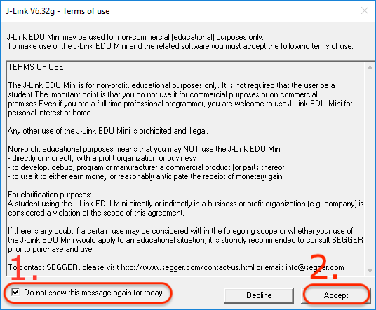

## jlink-accept-license
##### Shell script to automatically accept J-Link terms of use

I occassionally need to use my J-Link remotely via SSH. If it is the first time running one of the tools (e.g., `JLinkGDBServer`) for the day, a dialog box is presented on my X11 display which I cannot see or interact with. 

This script uses [`xdotool`](https://github.com/jordansissel/xdotool) to:
1. Locate the `J-Link <VERSION> - Terms of use` dialog,
2. Check the "do not hassle me" checkbox, and 
3. Click the `Accept` button:

[](image/jlink-eula.png)

## Usage
#### Legally, I **forbid** you to use this software.

If you encounter a message like the following:

```
% jlink-accept-license
Error: Can't open display: (null)
Failed creating new xdo instance
```

Try setting your `DISPLAY` environment variable:
```
% DISPLAY=:0 jlink-accept-license
```
